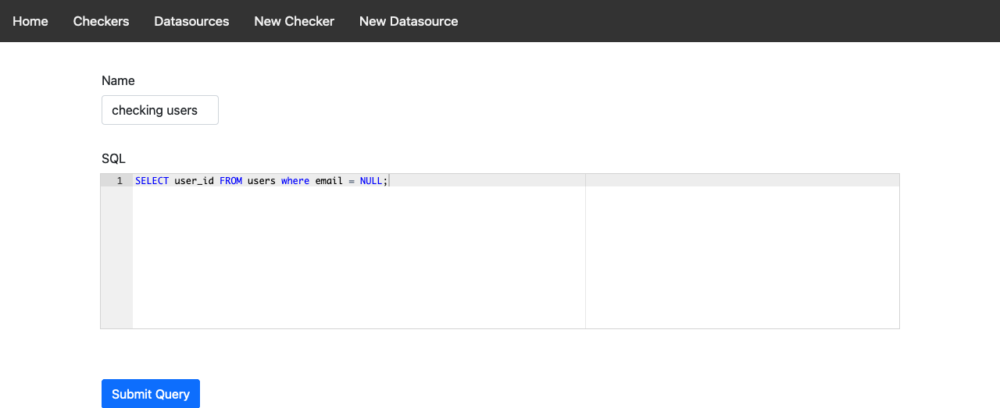
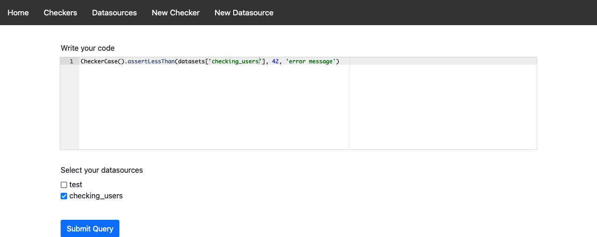

# malleable-checker

- A PoC of a [malleable system](https://malleable.systems/) that let's you build rules using a GUI or a script to assert your production data. If something does not pass an assertion, an alarm is triggered.
- This is a toy/pet 🐈‍⬛ project done on my free time, it's going to take a while to be ready for a demonstration.


## How it works?

- You define the datasource (e.g. an SQL query)
- Using either a HTML form or a python script you assert what you expect of that data.
- If the assertions fail, the alarm is triggered

For example, with the following datasource:
```sql
// Data source id = 32, name = 'users_with_email_null'
SELECT username from users where email is null;
```

You can create a new rule:

```python
CheckerCase().assertLessThan(datasets['users_with_email_null'], 
  42, 
  'There should be less than 42 users in that state') # Otherwise we are going to alarm

```

The interesting bits is that you can use Python code for it, so you could define your own helpers and write things like:

```python

if bussiness_day():
  CheckerCase().assertLessThan(datasets['users_with_email_null'], 42, 'There should be less than 42 users in that state')
else:
  CheckerCase().assertLessThan(datasets['users_with_email_null'], 5, 'There should be less than 5 users in that state')

```

This is executed hourly by a cron job, if the assertion throws an exception an Alarm will be fired. After the alarm is fired an action is triggered as defined by the user (email, slack, page).

After saved, the alarm has two values red and green. Red means the checker failed and the alarm was triggered. Green means everything is ok.


### Problems

- Ideally the user defined python code should run in a container, with almost no permission and not able to import anything. Right now the only protection it has is to remove any import AST node. So the user cannot import any module to write/read on disk or to access the sqlite3 database directly.
   - Although they can still run exec/eval in order to do that :P. I need to remove it. //TODO ;)
- Checkers should run on read-only mode, if you have multiple replicas, it should probably read the secondary/read-only.
- Need proper logging.

### What is already done?

- Front-end already works, tho the UX/UI is not done, right now we only have the forms (they are usable)
- Backend already works, you just need to set the cronjob manually

### How to use it?

- To build the dock image just use: `./build_docker.sh`
- To start the docker image just use `./start_docker.sh`
- Frontend is at http://localhost:5000
- RabbitMQ management at `http://localhost:15672` (guest username and password)
- To run the checkers manually, with docker exec open a Bash terminal and:
  - `cd home/checker/` 
  - `CONFIG=config.ini python3 alarm_assert/alarm_assert/checker.py`
- The previous code is also what should go in the cronjob. I didn't commit a crontab file, but you just need to run the previous python script every 5 minutes.

## On Images

Basically, you type your SQL query:




Then you can either use the advanced option and write the rule in python or use a normal HTML form to create the rule:




## Structure

The project have two main parts:

- alarm_assert: package defining the DSL for rules and how they should be executed
- front_end: package responsible for the UI and also the front-end database (saving the rules, datasources, rules states and results).


## TODO
- Check if it's a good idea to run the custom code in a WASM env.
